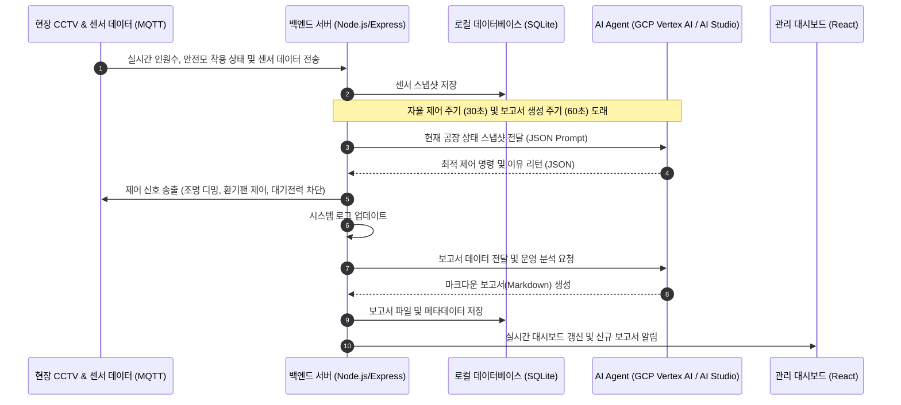

# Aegis Factory: AI 에이전트 기반 자율 운영 및 에너지 최적화 시스템
> **Aegis Factory: Autonomous Operations & Energy Optimizer**

본 문서는 산업 현장의 안전을 확보하고 에너지 소비를 극대화하여 절감하는 차세대 스마트 팩토리 제어 솔루션인 **Aegis Factory**의 기술 사양 및 프로젝트 개요를 기술합니다.

---

## 1. 프로젝트 배경 및 산업 현황
* **제조업의 에너지 비용 상승**: 최근 글로벌 에너지 가격 변동성 확대 및 전기요금 인상으로 인해 제조 공장의 고정비 중 전력 에너지가 차지하는 비중이 급격히 증가하고 있습니다.
* **ESG 경영 및 탄소 중립 규제**: 탄소 배출량(CO2) 저감 의무화 및 ESG 평가 지표 강화에 따라, 산업 현장에서는 에너지를 효율적으로 관리하기 위한 구체적인 솔루션이 강력히 요구됩니다.
* **산업 안전 보건법 강화**: 중대재해처벌법 및 현장 작업 환경 안전 규정이 대폭 강화되면서, 미착용 보호구 감지 및 위험 지역 혼잡도 통제 등 작업자의 생명과 안전을 보호하기 위한 실시간 안전 모니터링이 필수 요소로 자리 잡았습니다.

## 2. 문제 정의
* **에너지 낭비의 상시화**: 작업자가 부재중이거나 유휴 가동 상태인 설비 및 구역에서도 조명, 환기팬, 설비 대기전력이 100% 가동되는 등 비효율적인 전력 소비가 일상적으로 발생하고 있습니다.
* **수동 제어의 한계**: 현장 관리자가 매번 상황을 인지하고 조명 밝기를 낮추거나 스마트 아울렛을 끄는 수동 방식은 실시간 대응이 불가능하며, 관리 인력 부족으로 방치되는 경우가 다반사입니다.
* **안전 감시 공백**: CCTV 모니터링 요원이 24시간 수십 대의 카메라를 완벽히 주시하는 것은 불가능에 가까우며, 작업자의 안전모 미착용 등 미세한 위험 요소를 실시간으로 적출하여 대처하기 어렵습니다.

## 3. 기존 시스템의 한계
* **단순 규칙 기반(Rule-based) BEMS/FEMS의 한계**: 기존의 빌딩/공장 에너지 관리 시스템은 사전 정의된 스케줄(예: 퇴근 시간 이후 일괄 소등)이나 임계치에 따라 기계적으로 동작하므로, 조업 스케줄 변동이나 예상치 못한 야근/조기 출근 등 실시간 현장 유동성에 민첩하게 대응하지 못합니다.
* **파편화된 시스템**: CCTV 영상 분석(안전)망과 전력/설비 제어(에너지)망이 완벽히 분리되어 있어, "작업자가 안전 장비를 미착용했으니 조명을 밝히고 대피 방송을 한다"거나 "무인 상태이므로 대기전력을 차단한다"와 같은 융합형 지능 제어 시나리오를 실행하기 어렵습니다.
* **정성적 보고 체계**: 일일 근무가 끝난 뒤 작성되는 일지나 보고서가 단순 텍스트나 정량화되지 않은 서식으로 이루어져, 실질적인 에너지 절감률 피드백이나 잠재 위험 요인에 대한 추적 및 최적화 전략 수립이 저하됩니다.

## 4. 우리 서비스의 솔루션 (Aegis Factory)
**Aegis Factory**는 Vision AI 기반의 실시간 현장 분석 기술과 거대 언어 모델(LLM) 기반의 지능형 AI 에이전트를 결합하여, **"인지 - 판단 - 제어 - 분석"**이 인간의 개입 없이 자율적으로 이루어지는 차세대 통합 스마트 팩토리 솔루션입니다.
* **Vision AI 융합**: 카메라 스트림을 통해 실시간으로 작업자 수, 밀집 상태, 안전장구(안전모) 착용 여부를 식별합니다.
* **AI 에이전트 자율 제어**: 분석된 현장 상태를 토대로 구역별 조명 디밍, 환기 설비 세기, 스마트 아울렛을 통한 대기전력 차단 등을 실시간 최적 수준으로 자율 제어합니다.
* **피드백 루프 자동화**: 수집된 데이터를 바탕으로 AI가 일일/교대 근무 분석 보고서를 자동으로 생성 및 보관하여 지속적인 의사결정 고도화를 지원합니다.

## 5. 핵심 기능들
1. **실시간 구역 모니터링 & 조작**:
   * Zone A(생산), Zone B(창고), Zone C(조립), Zone D(포장)의 실시간 온도, 습도, 인원수, 조도, 풍량 감시 및 실시간 수동 제어 오버라이드 지원.
2. **Vision AI 기반 안전 검출**:
   * 작업자 밀집도 초과(Crowded) 자동 감지 및 실시간 위험도 수준 평가.
   * 안전모 미착용(Helmet Violation) 검출 및 관리자 경고 팝업, 현장 경고 방송(VHF/PA) 원클릭 송출 기능 제공.
3. **지능형 에너지 세이빙 알고리즘**:
   * 실시간 상태에 맞춰 기기 제어 신호 자동 발생 및 적용 (무인 구역 조도 20% 이하 감축, 대기전력 스마트 아울렛 차단 등).
   * 기준 전력 부하(Baseline) 대비 AI 절약 전력 실시간 그래프 시각화 및 누적 비용 절감액 계산.
4. **AI 에이전트 대화 및 질의 응답**:
   * 챗봇 인터페이스를 통해 "Zone B의 전력 사용 현황 알려줘", "오늘 누적 절감액은 얼마야?" 등의 대화형 질의 처리 및 로컬 폴백 지원.
5. **일일 교대 운영 보고서 자동 보관함**:
   * 주기적(백그라운드 60초 주기) 혹은 즉시 수동으로 보고서를 생성하고 데이터베이스에 보관.
   * 보고서 데이터를 파싱하여 KPI 카드, 상세 표, 안전 경보 목록 형태로 가독성 있게 변환하는 **시각 대시보드 뷰어** 탑재.

## 6. AI Agent 운영 흐름


## 7. 시스템 아키텍처
```mermaid
graph TD
    subgraph Frontend [사용자 UI (React/Vite)]
        A[대시보드 메인 페이지] --> B[CCTV/센서 모니터링 컴포넌트]
        A --> C[에너지 시각화 차트]
        A --> D[AI 챗봇 인터페이스]
        A --> E[보고서 보관함 & 대시보드 뷰어]
    end

    subgraph Backend [백엔드 API (Node.js/Express)]
        F[API 라우터] --> G[AI 최적화 & 제어 매니저]
        F --> H[데이터베이스 매니저]
        F --> I[MQTT 클라이언트 라이브러리]
    end

    subgraph DataStore [저장소]
        J[(SQLite - sensor_data.db)]
        K[로컬 파일 시스템 - .md 레포트 저장]
    end

    subgraph ExternalServices [외부 AI 플랫폼]
        L[GCP Vertex AI API]
        M[Google AI Studio API]
    end

    Frontend -- HTTP/REST -- > Backend
    Backend --> DataStore
    Backend -- Fallback Pipeline -- > ExternalServices
```

## 8. 기술 스택 및 개발 환경
### 기술 스택
* **Frontend**: React (Vite 빌드 도구 사용), Recharts (차트 시각화), Lucide React (아이콘 라이브러리)
* **Styling**: Vanilla CSS (커스텀 글래스모피즘 및 다크 모드 테마 구현)
* **Backend**: Node.js, Express (RESTful API), better-sqlite3 (경량 고성능 DB 커넥터)
* **Database**: SQLite (센서 정보 스냅샷 및 자동/수동 생성 레포트 영구 보관)
* **AI Model**: GCP Vertex AI (Gemini 1.5 Flash), Google AI Studio (API Key Paid Tier 폴백 지원)

### 개발 및 실행 환경
* **OS**: macOS / Linux 호환
* **런타임**: Node.js v18 이상
* **개발 서버 Port**: Backend (5050), Frontend (5173 - Vite dev)

## 9. 정량적 목표
* **에너지 소비 절감**: 공장 전체 기본 소비 전력(Baseline) 대비 최적화 동작 시 **평균 25% 이상의 전력 에너지 절약** 달성.
* **반응 시간 단축**: 현장 안전 위반 및 혼잡 상태 감지 시 즉각적인 제어 반영 및 경보 송출 반응 속도 **1초 미만** 확보.
* **보고서 수동 작성 시간 제로**: 교대 근무 후 수작업으로 30분 이상 소요되던 일일 분석 및 개선 대책 수립 업무를 **AI 백그라운드 자동화를 통해 실시간 처리(0초)**.

## 10. 기대 효과
* **운영 비용(OPEX) 절감**: 불필요하게 가동되는 보조 공조 설비와 조명의 대량 에너지를 자동 억제하여 즉각적인 공장 관리비 절감 실현.
* **무재해 사업장 달성**: CCTV 모니터링 공백기에도 AI가 실시간으로 안전모 미착용 및 고밀집 위험 구역을 탐지하고 관리자 검증을 요청하므로 사고 발생 가능성을 선제적으로 예방.
* **데이터 기반의 설비 투자 의사결정**: 누적 수집되는 AI 자율 운영 보고서를 바탕으로 비효율이 고착화된 노후 설비 식별 및 교체 우선순위 수립 가능.

## 11. 차별성 및 경쟁력
* **하이브리드 AI 폴백 아키텍처**: 클라우드 계정 권한 오류나 대량 API 요청 제한(429 Error)이 발생할 경우, **GCP Vertex AI ➔ Google AI Studio (Paid Key) ➔ 로컬 룰 기반 휴리스틱 엔진**으로 이어지는 3단계 폴백 시스템을 내장하여 무중단 운영 보장.
* **시각 대시보드 파서 탑재**: 딱딱하고 가독성이 떨어지는 긴 텍스트 마크다운 형식의 보고서를 실시간 파싱하여 주요 KPI 카드, 깔끔하게 정리된 구역 제어 표, 안전 위반 배지로 실시간 시각 변환하여 가독성 혁신.
* **안전-에너지 유기적 통합**: 독립적으로 운영되던 현장 비디오 분석 데이터와 전력 배전반 제어 시스템을 결합하여, 현장의 활성 밀도와 안전 상태에 따라 동적으로 에너지를 분배하는 스마트 자율제어 구현.

## 12. 활용 분야 및 확장성
* **중소·중견 제조 공장**: 대규모 자본의 전력 효율 시스템(FEMS) 도입이 힘든 환경에 플러그인 형태로 저비용 도입 가능.
* **물류 창고 및 저장 유통 센터**: 구역별로 작업 인원의 이동이 잦고 조명/환기 부하 비중이 큰 물류 센터의 에너지 세이빙에 극적인 효과.
* **다양한 안전 모델 확장 연동**: 안전모 이외에 안전 조끼 미착용, 작업자 쓰러짐 감지, 화재/연기 감지, 비인가 구역 침입 방지 등 Vision 분석 알고리즘 모델 추가 탑재 및 제어 연동 용이.

## 13. 결론
**Aegis Factory**는 고물가·고금리 시대의 제조 기업들이 직면한 에너지 고비용 문제와 중대재해 제로라는 시대적 과제를 동시에 해결하기 위한 혁신적인 솔루션입니다. 첨단 Gemini LLM 기술을 산업 제어에 안전하게 녹여냄으로써 스마트 팩토리를 넘어 자율형 자립 공장(Autonomous Factory)으로 나아가는 첫걸음이 될 것입니다.
